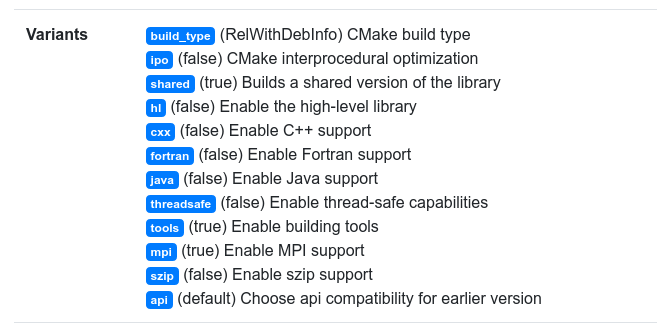

# Spack

[Spack](https://github.com/spack/spack) is an open source package manager developed by Lawrence Livermore National Lab that can help you to install complex software stacks by allowing for multiple versions of things to co-exist. If your cluster doesn't provide an installation for you, this short tutorial will walk you through using spack for the first time, and pointing out notable features. 

## Installation

Installation means cloning the repository, or if you prefer, a [release](https://github.com/spack/spack/releases).

```bash
$ git clone https://github.com/spack/spack
$ cd spack
```

You should run this command, or add to your `.bashrc` to have this done when you open a new shell.

```bash
$ . share/spack/setup-env.sh
```

And to discover compilers on your system:

```bash
$ bin/spack compiler find
==> Found no new compilers
==> Compilers are defined in the following files:
    /home/vanessa/.spack/linux/compilers.yaml
```

Spack does have a few [system dependencies](https://spack.readthedocs.io/en/latest/getting_started.html?highlight=curl#system-prerequisites), but generally if you are missing something it will yell at you and then you can install it. Unless your computer (or you!) are a dinosaur there is a good chance you'll have them all.

## Commands

### Install Something

The first thing you probably want to do is install something. There are two ways to go about this:

 1. install to your spack install (without an environment)
 2. install to an environment


#### Install without an environment

Want to search for software? Use `spack list`

```bash
$ spack list singularity*
==> 3 packages.
singularity  singularity-legacy  singularityce
```

Okay let's install singularityce! What versions are available?

```bash
$ spack versions singularityce
==> Safe versions (already checksummed):
  master  3.8.0
==> Remote versions (not yet checksummed):
  3.9.0-rc.1  3.8.3  3.8.2  3.8.1  3.8.0-rc.2
```

To install the latest we would leave out a version, and to install a specific version use `@`:

```bash
# latest
$ spack install singularityce

# 3.8.0
$ spack install singularityce@3.8.0
```

Here are some other installation tricks and examples:

```bash
# install zlib using gcc 6.5.0
$ spack install zlib %gcc@6.5.0

# Add cppflags, also can add cflags, cxxflags, fflags, ldflags, and ldlibs parameters
$ spack install zlib@1.2.8 cppflags=-O3

# Install tcl and specify the version of the dependency to use, and compiler
$ spack install tcl ^zlib@1.2.8 %clang

# Install hdf5 without mpi support
$ spack install hdf5~mpi

# Install hdf5 without mpi support
$ spack install hdf5~mpi

# Install hdf5 with mpi, using mpich
$ spack install hdf5+hl+mpi ^mpich

# Install Trilinos with a dependency on hdf5 built with mpich
$ spack install trilinos+hdf5 ^hdf5+hl+mpi ^mpich
```

The little "flags" for a package are called variants - and you don't need to predict them, you can look at the variants of the package itself,
or just navigate to the package's page. For example, [here](https://spack.github.io/packages/package.html?name=hdf5) is the page for hdf5 and we can
clearly see that "hl" enables the high level library, and "mpi" is the flag to enable (or disable) support.



Although some spack packages have debug variants, not all do! For libraries that support
adding debug during compile, here is a trick to enable it globally:

```bash
# Build with debug, even if there isn't a variant!
export SPACK_ADD_DEBUG_FLAGS=true
spack install zlib

# Customize debug flags
export SPACK_ADD_DEBUG_FLAGS=true
spack install zlib
export SPACK_DEBUG_FLAGS="-g"
```

Installation is entirely from source - so it's going to take a long time! Go make yourself a sandwich, you deserve it! 🥪️
When it's done, check out what you have installed with `spack find`:

```bash
$ spack find
==> 98 installed packages
-- linux-ubuntu20.04-skylake / gcc@9.3.0 ------------------------
autoconf@2.69                        json-c@0.15           openmpi@4.1.1            py-snowballstemmer@2.0.0
```

You can use spack find to find versions of packages that you might want to uninstall:

```bash
# Uninstall all trilinos packages
$ spack uninstall --all trilinos

# And dependencies too!
$ spack uninstall --dependents --all trilinos
```

#### Install with an environment

A spack environment is akin to any other virtual environment in that you are going to activate it, install stuff, and then deactivate. It's convenient for keeping things modular and organized. You'll want to create, and install things to your environment.

```bash
# create an environment called "myproject"
$ spack env create myproject

# remember what we called it (and others?)
$ spack env list
==> 1 environments
    myproject

# Activate it!
$ spack env activate myproject

# I forgot if I'm in an environment?
$ spack env status
==> In environment myproject

# Add some packages to install
$ spack add zlib
$ spack add singularity

# Do the install
$ spack install

# or instead just install in serial
$ spack install zlib
$ spack install singularity

# In the environment, installs are on your PATH!
$ which singularity
../myproject/.spack-env/view/bin/singularity

# deactivate
$ spack env deactivate
```

You can see the full, detailed spack environments tutorial [here](https://spack-tutorial.readthedocs.io/en/latest/tutorial_environments.html).


## Other questions?
If you have other questions, or want help for your project, please don't hesitate to <a href="https://github.com/rse-ops/knowledge/issues">reach out</a>.
