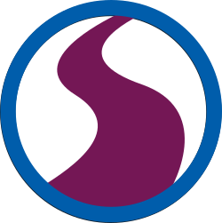

# Welcome to the RSE-Ops Knowledge Space

> Research Software Engineering Ops Knowledge Space

This is a community initiative to collect best practices, tutorials, and other knowledge
for the Research Software Engineering (Ops) community. If you haven't heard of RSE-ops,
take a look at the [landscape here](https://rse-ops.github.io/landscape/).

## Purpose

As Research Software Engineers, we have a lot of knowledge around software development,
automation, and high performance computing. This knowledge can generally be summarized under
the label "RSE-ops" which gets at these good practices for automation and monitoring that
come from DevOps, but places the focus on the Research Software Engineering community.

These pages (and the template) are under development, and there is much more content to come! 
For questions or other interactions, we encourage you to [Open an issue]({{ site.repo }}/issues)


```{toctree}
:caption: Documentation
:maxdepth: 2
docs/index.md
```

```{toctree}
:caption: About
:maxdepth: 1
about/index.md
```

<script>
// This is a small hack to populate empty sidebar with an image!
document.addEventListener('DOMContentLoaded', function () {
    var currentNode = document.querySelector('.md-sidebar__scrollwrap');
    currentNode.outerHTML =
	'<div class="md-sidebar__scrollwrap">' +
		'' +
		
	'</div>';
}, false);

</script>
